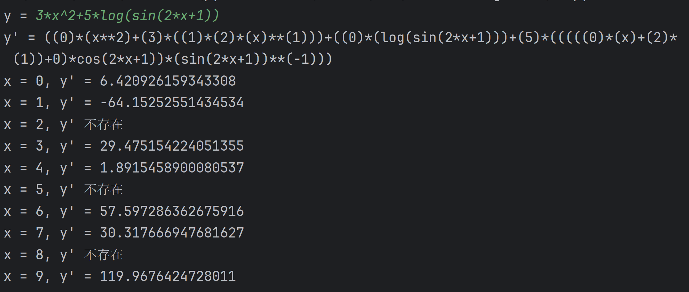

# 函数求导

derivative function by PYTHON  
有加、减、乘、乘方运算，可以求导复合函数、指数函数、对数函数、幂函数、两个三角函数（sin cos）。  
其他需要自己组合（例如对数函数用换底公式；tanx=sinx/cosx 等），除法需要表示成某项-1次方，根号表示成小数次幂。  
可以定义参数，相当于可以求偏导。  
函数结果再输入函数一遍可以求更高阶导数，但有可能报错。  
示例：  

